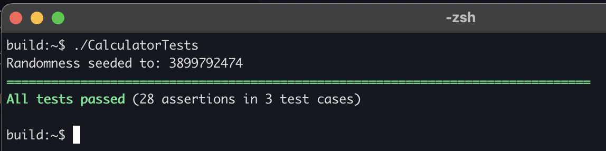

# Calculator

Terminal tool to perform basic calculations.


Supported functionality:

- Integer and decimal numbers
- Parenthesis: `(`, `)`
- Basic operations: `+`, `-`, `*`, `/`

## Install, Build & Run

Open a terminal window and clone parent repository

```text
https://github.com/Serious-Fin/cpp-training.git
```

Step into the cloned directory

```text
cd calculator
```

Make a new directory `libs` and step into it

```text
mkdir libs
cd libs
```

Clone `Catch2` into the `libs` directory. It is used for running tests

```text
git clone https://github.com/catchorg/Catch2.git
```

Go to back to `calculator` directory, make a new build directory and step into it

```text
cd ..
mkdir build
cd build
```

Generate build files using CMake ([download CMake](https://cmake.org/download/) if you don't have it)

```text
cmake ..
```

Build the project

```text
cmake --build .
```

Now you can calculate expressions

```text
./calculator "2 + 5 * 4"
```

## Running Tests

Tests are stored in `./tests` directory. They are compiled and build with the CMake tool as well. To run the tests, build the project as instructed above. Running tests can be performed with `./CalculatorTests` command.


